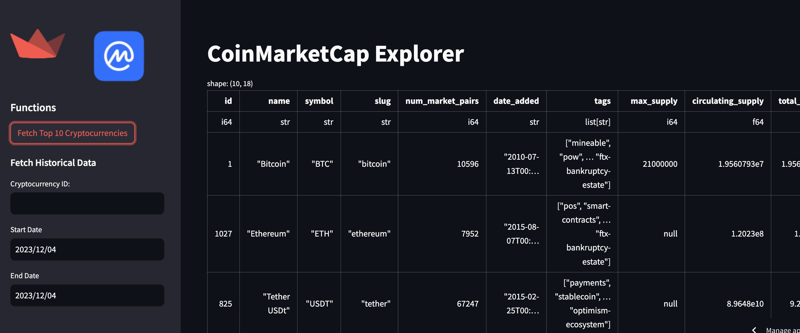

# CoinMarketCap Connection for Streamlit


A Streamlit connection component to connect Streamlit apps to the CoinMarketCap API for cryptocurrency market data.

## 🚀 Features
- Easy integration with Streamlit applications.
- Access to real-time and historical cryptocurrency data including prices, market caps, and trading volumes.
- Efficient handling of API rate limits.
- Simple configuration using API key.

## 🧑‍🎓 Getting Started
### Installation
Install `coinmarketcap_connection` via pip:
```bash
pip install coinmarketcap_connection
```

### 🔩 Configuration
Set your CoinMarketCap API key in the secrets.toml file for Streamlit apps as described in the Streamlit [documentation](https://docs.streamlit.io/library/advanced-features/secrets-management).

### 🔍 Usage
Import
```bash
from coinmarketcap_connection import CoinMarketCapConnection
```

Initialize
```bash
cmc_connection = CoinMarketCapConnection("YOUR_CONNECTION_NAME")
```

### Fetch Data
Use the connection to fetch the latest cryptocurrency data or historical data.

Fetch Latest Cryptocurrency Data
```bash
latest_data = cmc_connection.fetch_latest_data(limit=100)
```

Fetch Historical Cryptocurrency Data
```bash
historical_data = cmc_connection.fetch_historical_data(cryptocurrency_id=1, start_date='2023-01-01', end_date='2023-01-31')
```

### 📑 Documentation
For detailed documentation, visit [CoinMarketCap API documentation](https://coinmarketcap.com/api/documentation/v1/).
